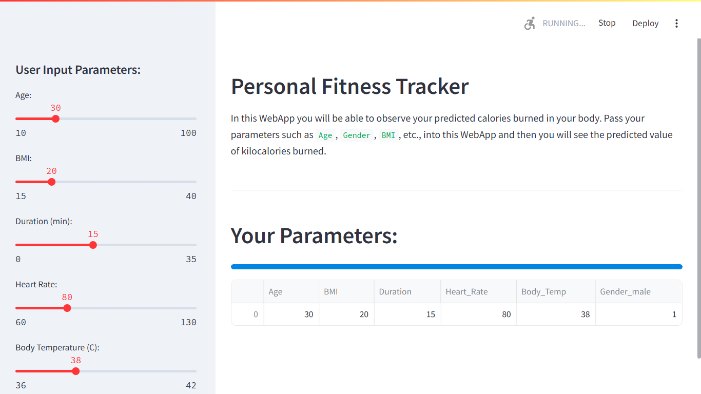
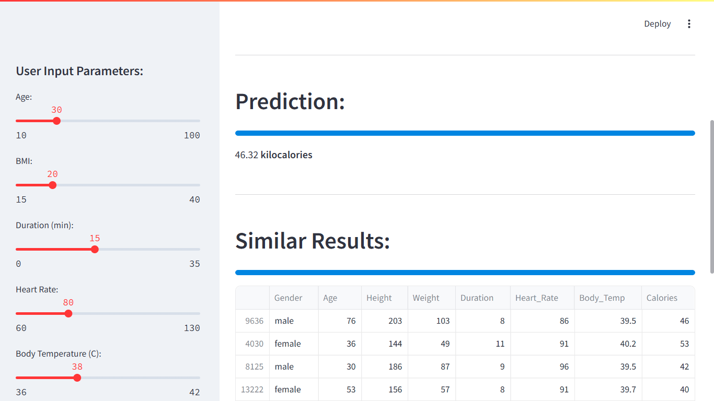
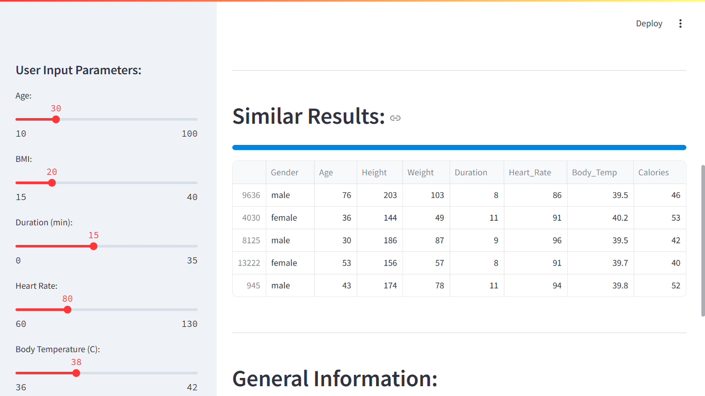
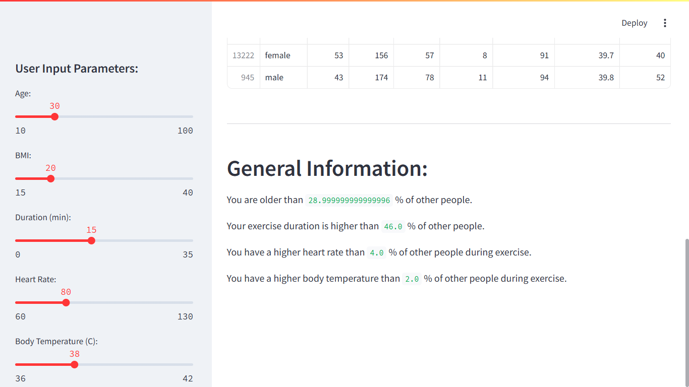

# 🏋️‍♂️ Implementation of Personal Fitness Tracker using Python

<div align="center">
  
  
  
</div>

## 🚀 Project Overview

This **Personal Fitness Tracker** is an AI-powered web application that predicts the number of **kilocalories burned** based on user-specific input parameters like Age, Gender, BMI, Duration, Heart Rate, and Body Temperature. The model is trained using real-world fitness and calorie data to help users gain insights into their workout effectiveness.

> 🎯 **Internship Title**: Foundations of Artificial Intelligence  
> 👨‍💻 **Internship Provider**: Edunet Foundation  
> 🤝 **Industry Partner**: Microsoft AI National Skilling Initiative

---

## 📂 Folder Structure

```

Implementat\_on\_of\_Personal\_Fitness\_Tracker\_using\_Python/
│
├── Asserts/                   # 📸 Screenshots (4 Desktop + 4 Mobile)
│
├── app.py                    # 🎯 Main Streamlit Application
│
├── calories.csv              # 📊 Calorie dataset
│
├── exercise.csv              # 📊 Exercise dataset
│
├── fitness\_tracker.ipynb     # 📒 Jupyter notebook version of the project
│
└── README.md                 # 📘 Project documentation (You're here!)

````

---

## 🧠 Technologies & Tools Used

- **Python** 🐍
- **Streamlit** 🌐
- **Scikit-learn** 🤖
- **Pandas, NumPy** 📈
- **Matplotlib, Seaborn** 📊

---

## 🎥 Demo & Screenshots

### 💻 Desktop View:
| Screenshot 1 | Screenshot 2 | Screenshot 3 | Screenshot 4 |
|--------------|--------------|--------------|--------------|
|  |  |  |  |

### 📱 Mobile View:
| Screenshot 1 | Screenshot 2 | Screenshot 3 | Screenshot 4 |
|--------------|--------------|--------------|--------------|
|  |  |  |  |

---

## ⚙️ Features

- 🔢 Predicts calories burned based on health & activity metrics
- 🎛️ Interactive sliders for user input
- 📈 Data visualization using charts and metrics
- 🧠 Powered by **Random Forest Regressor**
- 🎯 Highlights your fitness level compared to dataset
- 💡 Provides similar case studies for comparison

---

## 🧪 How to Run

1. **Clone the Repository:**
```bash
git clone https://github.com/your-username/Implementat_on_of_Personal_Fitness_Tracker_using_Python.git
cd Implementat_on_of_Personal_Fitness_Tracker_using_Python
````

2. **Install the Dependencies:**

```bash
pip install -r requirements.txt
```

3. **Launch the App:**

```bash
streamlit run app.py
```

---

## 📚 Learnings & Experience

This project helped me strengthen my skills in:

* AI model training & evaluation
* Data preprocessing and feature engineering
* Building interactive UIs with Streamlit
* Presenting insights from real-time predictions

> This project was developed as part of my AI internship to showcase practical applications of **machine learning in fitness and healthcare**.

---

## 📢 Acknowledgements

🙏 Special thanks to **Edunet Foundation** and **Microsoft AI National Skilling Initiative** for providing this valuable opportunity.

---

## 📬 Contact

📧 **Roni Seikh**
📍 *B.Tech CSE, Brainware University*
🔗 [LinkedIn](https://www.linkedin.com/in/roniseikh) | [GitHub](https://github.com/Roni-Seikh)

---

⭐ If you liked this project, don't forget to give it a star on GitHub!
